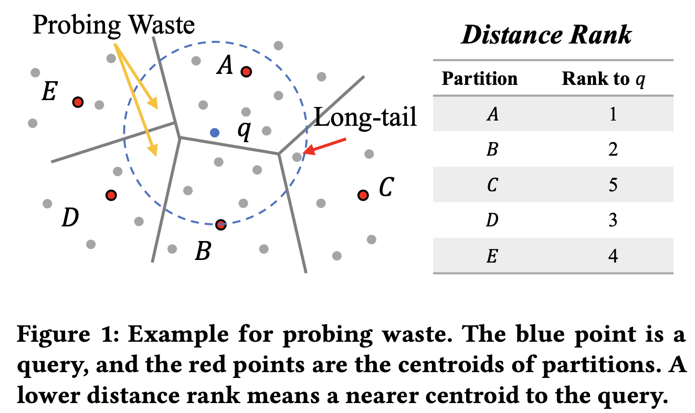
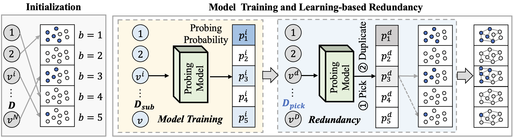
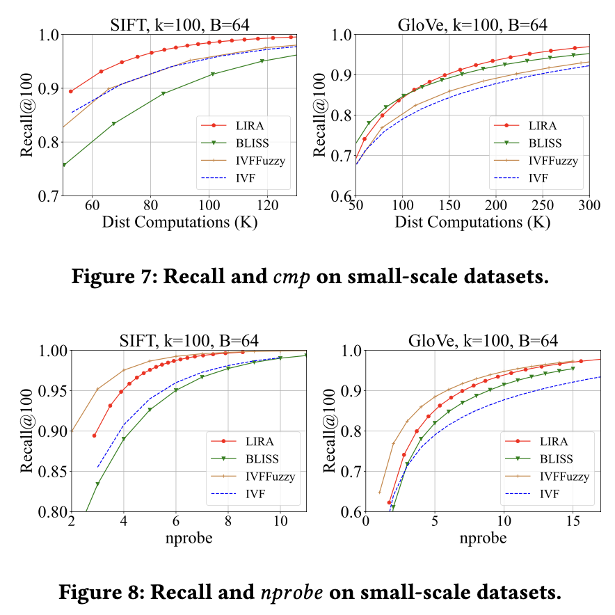

# :sunny: [WWW'2025] LIRA
[](https://doi.org/10.5281/zenodo.14836338)


This is an official implementation of the paper: [**LIRA: A Learning-based Query-aware Partition Framework for Large-scale ANN Search**](https://arxiv.org/abs/2503.23409).

To enhance search efficiency of approximate nearest neighbor (ANN), a set of partition-based methods are proposed to narrow down the search space by merely probing partial partitions. However, they have two common unsolved issues. First, partition probing with distance ranks in the query phase is a widely adopted strategy in existing studies such as IVF, which will inevitably probe the partitions that are irrelevant to the query results since the data distribution is not considered in this strategy. Second, all the partition-based indexes have the boundary problem that separates the kNN of a query to multiple partitions and produces a long-tailed kNN distribution, which degrades the optimal nprobe and the search efficiency. To deal with these problems, we propose a LearnIng-based queRy-aware pArtition framework, called LIRA. 


## :white_check_mark: Framework Overview

### Movitation


The inverted file (IVF) index builds clusters with the K-Means algorithm and then searches in fixed 𝑛𝑝𝑟𝑜𝑏𝑒 nearest partitions according to the distance rank between a query and the cluster centroids. We find two limitations in partition-based ANN search. (1) Partition pruning with the distance rank to partition centroids wastes 𝑛𝑝𝑟𝑜𝑏𝑒. (2) Hard partitioning cannot inherently achieve low 𝑛𝑝𝑟𝑜𝑏𝑒 due to the long-tailed distribution of 𝑘NN.

Hence, we improve the performance of partition-based ANN search from two aspects, query process and index construction. (1) A meta index that directly probes the 𝑘NN partitions is required. (2) Redundant partitioning is required to mitigate the long-tailed 𝑘NN distribution and further reduce 𝑛𝑝𝑟𝑜𝑏𝑒.

### Partition construction and index building



The workflow of LIRA can be divided into two distinct processes: the construction of redundant partitions and the top-k retrieval for queries.
Here, we illustrate the framework of the redundant partition construction through a toy example with 5 partitions.
After initializing the B partitions with the vanilla K-Means algorithm (LEFT), LIRA targets training a probing model (MIDDLE) to serve as the meta index (i.e., the probing model decides the partitions to probe for each query individually) and then refining the initial partition by learning-based redundancy (RIGHT) with the same probing model. We construct internal indexes for each partition individually after the redundant partitions are built.


## :bar_chart: Main Result


The results in Figs. 7 and 8 show that LIRA consistently reduces the latency and the query fan-out (i.e., nprobe) up to 30%. 
Please refer to more experiments results and detailed descriptions in the paper.


## :computer: Get Start

### Code Description
There are 6 files/folders in the source.
- `LIRA_smallscale.py`: The main python file for small-scale datasets with the probing model learning, learning-based redundancy and testing of query process. For the probing model is trained with the full dataset and the partitions are refined by few redundancy.
- `LIRA_largescale.py`: The main python file for large-scale datasets that is similar to `LIRA_smallscalre.py`, where the probing model is trained with a sampled dataset (i.e., 1% of the data for training) and the partitions are refined by a full redundancy (i.e., all data are duplicated once).
- `model_probing.py`: The probing model predicts the partitions to search for queries indivisually.
- `utils.py`: The basic functions to support LIRAs.
- `dataset`: The dataset folder where you can unzip the dataset files for testing.
- `log`: The logging of training process and query results.

The folders of `dataset` and `log` are empty when cloning this project. Please download datasets in the folder of `dataset`. The logging files and experiments results will be generated in the folder of `log`.


### Prerequisites

Please install
- Python 3.9
- Faiss 1.9.0

In experiments, we need Faiss that provides the distance computations count during search, thus the Faiss > 1.9.0 or Faiss < 1.5.2 (with Python==3.7) is required for correctly get `hnsw_stats.ndis`.

To install Faiss, please refer to https://github.com/facebookresearch/faiss/blob/main/INSTALL.md .


For Faiss 1.9.0
```
conda create -n lira39 python=3.9
conda activate lira39
conda install -c pytorch faiss-cpu=1.9.0
```


For Faiss 1.5.2
```
conda create -n Faiss1.5.2 python=3.7
conda activate Faiss1.5.2
conda install pytorch==1.12.1 cudatoolkit=11.3 faiss-cpu==1.5.2 -c pytorch
```


### Datasets


The datasets in experiments are available at the following links. 

Since the datasets exceeds GitHub's file size limit, we cannot provide the datasets in the opensource code unfortunately. The datasets are required to download on yourself.

https://github.com/erikbern/ann-benchmarks?tab=readme-ov-file

https://big-ann-benchmarks.com/neurips21.html


## Run

For training and evaluation, you can reproduce the experiment results as follows:
1. The config of dataset is set with SIFT dataset as default.
2. Run the codes for small-scale dataset.

```
cd ..
python LIRA_smallscale.py
```

## Citation
If you find this repository useful in your research, please cite the following paper for the paper in WWW'2025:

```
@inproceedings{10.1145/3696410.3714633,
author = {Zeng, Ximu and Deng, Liwei and Chen, Penghao and Chen, Xu and Su, Han and Zheng, Kai},
title = {LIRA: A Learning-based Query-aware Partition Framework for Large-scale ANN Search},
year = {2025},
isbn = {9798400712746},
publisher = {Association for Computing Machinery},
address = {New York, NY, USA},
url = {https://doi.org/10.1145/3696410.3714633},
doi = {10.1145/3696410.3714633},
booktitle = {Proceedings of the ACM on Web Conference 2025},
pages = {2729–2741},
numpages = {13},
keywords = {approximate nearest neighbor search, learning-to-index, vector retrieval},
location = {Sydney NSW, Australia},
series = {WWW '25}
}
```


## Contact
If you have any problem, feel free to contact ximuzeng@std.uestc.edu.cn.


